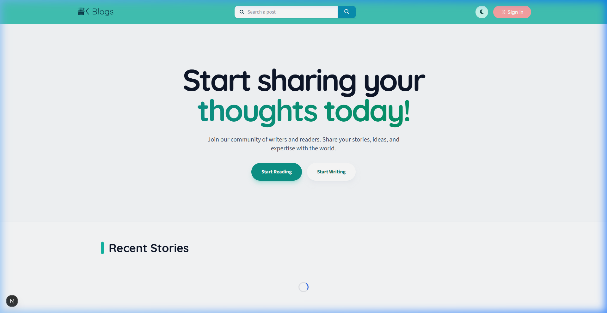
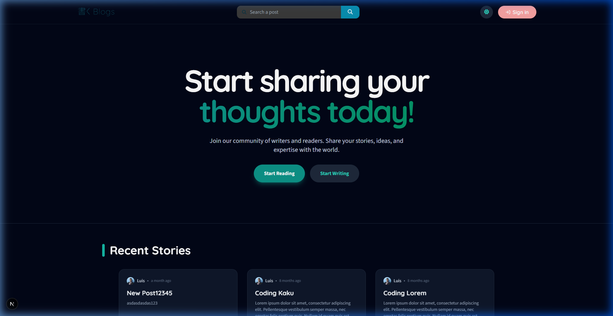
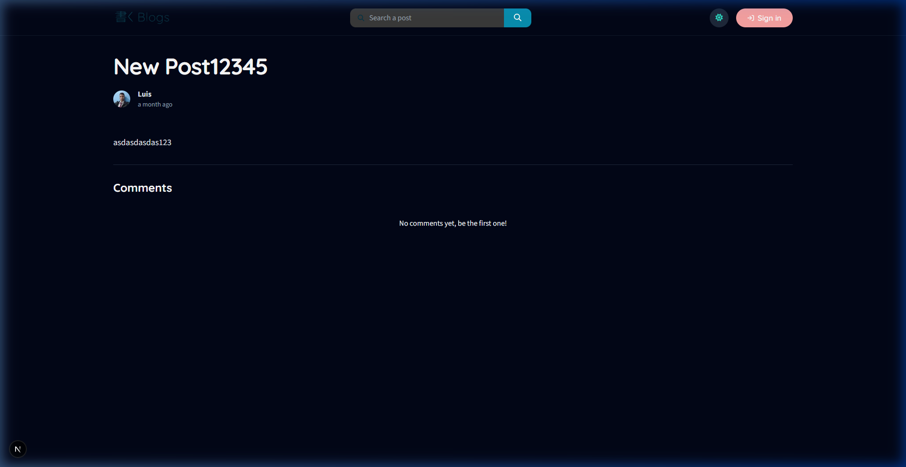
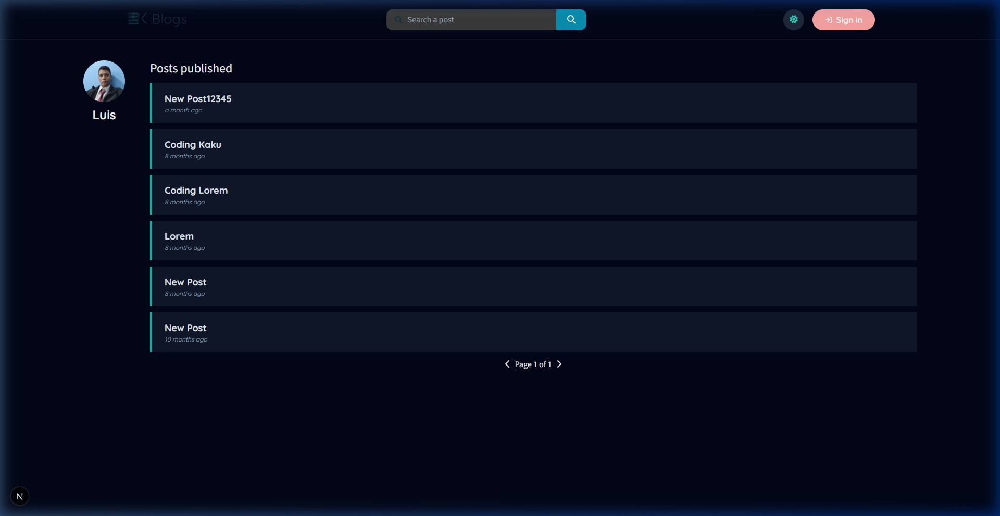

# 🖊️ Kaku Blogs

Kaku Blogs is a premium, Medium-inspired blogging platform built with the **T3 Stack**. It features a modern, responsive design with a focus on user experience, featuring glassmorphism, dark mode, and smooth animations.

---

## ✨ Features

- **🚀 Performance First**: Built with Next.js 16+ and Turbopack for lightning-fast development and production performance.
- **🎨 Modern UI/UX**: 
  - Fully responsive design with **Dark Mode** support.
  - Sleek **Glassmorphism** effects and smooth transitions using **Framer Motion**.
  - Dynamic "Recent Stories" feed with cursor-based pagination.
- **📝 Rich Content Creation**:
  - Full-featured rich text editor powered by **Quill**.
  - **Drafting System**: Save your work as drafts before publishing.
- **🔍 Advanced Search**: Full-text search with relevance ranking across titles and content.
- **👤 User Management**:
  - Secure authentication via **NextAuth.js** (GitHub integration).
  - Personalized user profiles showcasing all their published stories.
- **🧪 Robust Testing**: Unit tests with **Vitest** and E2E tests with **Playwright**.

---

## 📸 Screenshots

| Light Mode | Dark Mode |
| :---: | :---: |
|  |  |

| Post View | User Profile |
| :---: | :---: |
|  |  |

---

## 🛠️ Tech Stack

- **Framework**: [Next.js](https://nextjs.org/)
- **Styling**: [Tailwind CSS](https://tailwindcss.com/)
- **Animations**: [Framer Motion](https://www.framer.com/motion/)
- **Database**: [Prisma](https://www.prisma.io/) with LibSQL
- **API**: [tRPC](https://trpc.io/)
- **Auth**: [NextAuth.js](https://next-auth.js.org/)
- **Themes**: [Next Themes](https://github.com/pacocoursey/next-themes)

---

## 🚀 Getting Started

### Prerequisites

- Node.js installed
- Pnpm or Npm
- A PostgreSQL compatible database (e.g., Neon.tech)

### Installation

1. **Clone the repository**:
   ```bash
   git clone https://github.com/lbalbas/kaku-blogs.git
   cd kaku-blogs
   ```

2. **Install dependencies**:
   ```bash
   npm install
   ```

3. **Set up Environment Variables**:
   Copy `.env.example` to `.env` and fill in your credentials:
   ```bash
   cp .env.example .env
   ```

4. **Initialize the database**:
   ```bash
   npx prisma db push
   ```

5. **Start the development server**:
   ```bash
   npm run dev
   ```

---

## 🔑 Environment Variables

The following variables are required to run the project:

- `DATABASE_URL`: Your database connection string.
- `NEXTAUTH_URL`: The URL where your app is hosted (e.g., `http://localhost:3000`).
- `NEXTAUTH_SECRET`: A secret string for session encryption.
- `GITHUB_CLIENT_ID`: OAuth client ID from GitHub.
- `GITHUB_CLIENT_SECRET`: OAuth client secret from GitHub.

---

## 🧪 Testing

Run unit tests:
```bash
npm run test
```

Run E2E tests:
```bash
npm run test:e2e
```

---

## 🚢 Deployment

Follow the official deployment guides for the T3 Stack:
- [Vercel](https://create.t3.gg/en/deployment/vercel)
- [Netlify](https://create.t3.gg/en/deployment/netlify)
- [Docker](https://create.t3.gg/en/deployment/docker)

---

Built with ❤️ by [Luis Balbás](https://github.com/lbalbas)
